# AWS virtual network

## Contents

1. [Introduce](https://github.com/CasselKim/AWS_virtual_network#1-introduce)
2. [VPC 마법사 실행하기(VPC, 서브넷, IGW)](https://github.com/CasselKim/AWS_virtual_network#2-vpc-%EB%A7%88%EB%B2%95%EC%82%AC-%EC%8B%A4%ED%96%89%ED%95%98%EA%B8%B0vpc-%EC%84%9C%EB%B8%8C%EB%84%B7-igw)
3. [라우팅 테이블 설정하기](https://github.com/CasselKim/AWS_virtual_network#3-%EB%9D%BC%EC%9A%B0%ED%8C%85-%ED%85%8C%EC%9D%B4%EB%B8%94-%EC%84%A4%EC%A0%95%ED%95%98%EA%B8%B0)
4. [EC2, RDS랑 VPC 연동하기](https://github.com/CasselKim/AWS_virtual_network#4-ec2-rds%EB%9E%91-vpc-%EC%97%B0%EB%8F%99%ED%95%98%EA%B8%B0)
5. [EC2 인스턴스에 웹 프로젝트 올리기](https://github.com/CasselKim/AWS_virtual_network#5-%EC%9D%B8%EC%8A%A4%ED%84%B4%EC%8A%A4%EC%97%90-%EC%9B%B9-%EC%84%9C%EB%B2%84-rds%EC%97%90-mysql-%EC%98%AC%EB%A6%AC%EA%B8%B0)

## 1. Introduce  

AWS로 가상 네트워크 구축하기

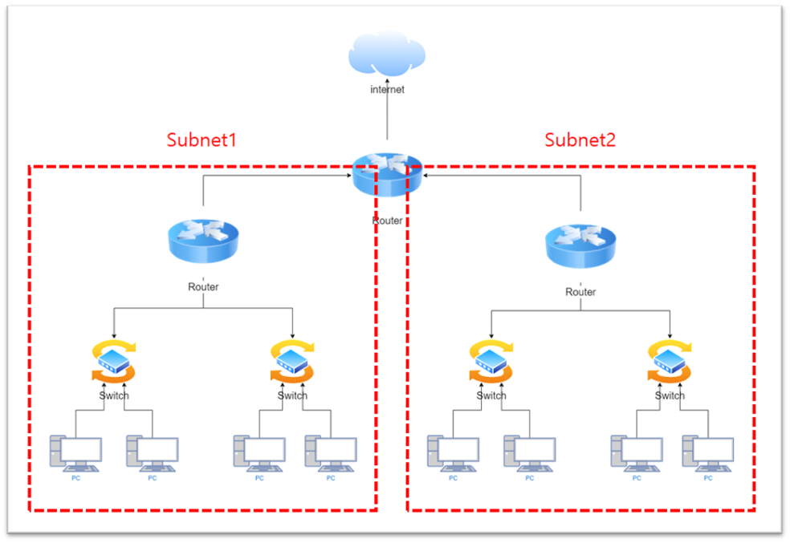  

물리적으로 네트워크를 구성하려면 위와 같이 구성한다.  

나이브하게 대응시키면  

- PC = EC2internetㅁ
- Switch = 가상 스위치(AWS에서는 subnet이 대신함)
- Router = Route table
- Serial Port = Internet Gateway
- NAT = NAT Gateway, NAT Instance

인터넷(Public Domain)과 논리적으로 구분되어, 계정마다의 가상 네트워크를 만드는 것을 Virtual Private Cloud(VPC)라고 한다. 

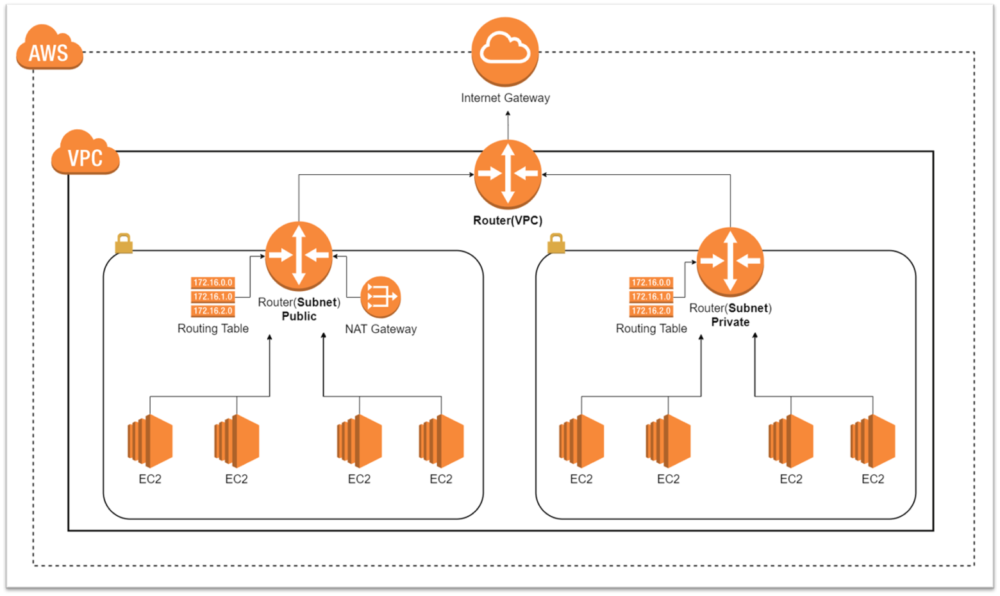  

약간 이런느낌? 실제로 라우터가 있는건 아니고, 개념적인 라우터랄까.. 모두 라우팅 테이블이라고 보면 된다. VPC에 기본적으로 탑재되어 있는 라우팅 테이블이 있는데 서브넷 별로 라우팅 테이블을 적용시킬 수 있다. 예를 들어 Private Subnet의 경우 외부->내부는 접근하지 못하지만(포트포워딩을 하지 않는 이상) 내부->외부는 가능하도록 Routing table을 NAT Gateway에 물린다. (0.0.0.0은 NAT table로 가라는 식)  

실제로 워크플로우는 Route53 -> IGW(인터넷 게이트웨이) -> VPC -> ELB(로드밸런서, AZ에 하나씩 들어있음) -> Subnet -> EC2 느낌이다.  

참고로 **Public Subnet에는 웹서버를, Private Subnet에는 DB서버를 올릴거다**.(보안때문에)

## 2. VPC 마법사 실행하기(VPC, 서브넷, IGW)

AWS에 로그인하고 검색창에 VPC를 검색하자.  첫번째로 할 일은 Elastic IP(EIP, 탄력적 IP)를 설정해야 하는데, 왼쪽 메뉴창에 탄력적 IP를 눌러서 하나 만들어준다.  

  

~~(시간당 0.004달러씩 나가니까 빨리하자)~~  

탄력적 IP란, 원래 AWS 인스턴스를 껐다가 켜면 IP가 바뀌는데 이 IP를 고정시켜주는 서비스를 말한다.  

탄력적 IP를 생성했으면 VPC 대시보드 탭을 누르고 VPC 마법사 시작 버튼을 누른다.  

  

그러면 이미 AWS에서 만들어놓은 프리셋들이 있을텐데, 우리는 public-private 쌍의 Subnet 네트워크를 만들거니까 두번째 항목을 누르고 선택버튼을 눌러준다.  

  

나머지는 대충 넣어주면 되는데, 탄력적 IP는 누르면 팝업이 뜨니까 눌러서 선택하면 된다.  

  

( - 라고 적혀있는건 default VPC이다.)  

VPC 마법사가 끝나면 위와 같이 VPC, 서브넷, 인터넷 게이트웨이까지 모두 구성이 완료된다.  직접 구성해도 되는데, 서브넷은 CIDR에 맞게 나눠서 할당해주면 되고 인터넷 게이트웨이도 VPC ID를 넣으면 연결된다.  

## 3. 라우팅 테이블 설정하기

위에서도 말했지만 VPC에는 기본적으로 라우팅 테이블이 있고 각 서브넷마다 라우팅 테이블을 설정해줄 수 있다고 했다. 목표는  

- 퍼블릭 서브넷(10.0.0.0) : 10.0.x.x 네트워크는 내부로, 나머지 모든 IP(0.0.0.0)은 외부로 (IGW)
- 프라이빗 서브넷(10.0.1.0) : 10.0.x.x 네트워크는 내부로, 나머지 모든 IP(0.0.0.0)은 NAT 게이트웨이로

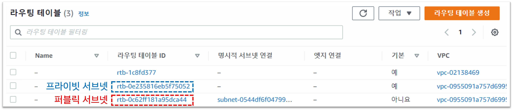    

    

VPC 마법사로 하니까 자동으로 다 되어있다. 셀프로 하고싶으면 NAT 게이트웨이 생성하고(왼쪽 메뉴에 있다) 위에 목표처럼 연결만 시켜주면 된다.  

## 4. EC2, RDS랑 VPC 연동하기

### EC2 생성하기

EC2는 물리적 네트워크에서 PC와 같은 포지션이라고 했다. EC2를 생성해보자.  

상단 검색창에 EC2 검색 -> 인스턴스 시작 -> Ubuntu Server 18.04 64비트(x86) 선택 -> t2.micro 선택 후 다음.   

  

  

웹서버 용 인스턴스를 퍼블릭 서브넷에 생성한다.  

  

새로운 탄력적IP를 생성해 연결해준다.    

### RDS 생성하기  

프라이빗 서브넷에 설치할 DB서버는 EC2가 아닌 AWS에서 제공하는 DB서버인 RDS를 생성해보겠다.  

#### 새로운 프라이빗 서브넷 생성하기

**그 전에, DB 서브넷 그룹은 두개 이상의 AZ에 걸쳐서 생성하라고 하니 다른 AZ에 프라이빗 서브넷을 넣고 오자.**  

상단 검색창에 VPC -> 서브넷 -> 생성 -> VPC 선택 및 서브넷 이름, 가용영역(원래거랑 다르게!), CIDR 입력 후 생성  

  

  

라우팅테이블도 추가해주자(NAT랑 연결).  

#### RDS 파라미터 그룹 생성하기

서브넷이 생성되었으니 RDS를 생성하러 가보자.  

상단 검색창에 RDS를 검색해서 파라미터 그룹 -> 생성 -> Mysql, 이름, 설명 -> 생성   

  

#### RDS DB 서브넷 그룹 생성하기

서브넷 그룹 -> 생성 -> 이름,설명,VPC선택 -> 가용영역(서브넷 설치된 두 개) -> 서브넷(프라이빗1,2) -> 생성  

  

  

#### RDS 생성하기

좌측 메뉴에서 대시보드 -> 데이터베이스 생성 -> MySQL -> 5.7x버전 -> 프리티어 -> VPC, 서브넷그룹, 퍼블릭연결, VPC 보안그룹, 가용영역 차례대로 선택 후 생성

  

  

  

## 5. 인스턴스에 웹 서버, RDS에 MySQL 올리기

EC2에 올릴 테스트용 웹 서버를 장고로 간단하게 만들어보았다. - [튜토리얼](https://docs.djangoproject.com/ko/4.0/), [깃허브](https://github.com/CasselKim/web_server_for_testing)  

  

질문을 올리면 리스트로 나타나는 웹서버이다. id, 질문내용, 날짜가 mysql에 저장된다. 웹 서버는 EC2에, MySQL은 RDS에 올려보자.  

### 1. EC2,RDS 인바운드 규칙 설정

EC2와 RDS가 서로 통신하기 위해 인바운드 규칙을 설정한다. 추가로 장고 통신을 위한 8000포트도 열어두자.  

  

  ### 2. EC2에서 RDS 접근하기

SSH연결로 EC2에 접근해보자. AWS창 -> EC2 -> 인스턴스 -> 인스턴스 선택 후 연결 -> 프라이빗 키 생성  

  

  

SSH에서 EC2에 접근했다면 우분투 기본설정을 해주도록 하자 (EC2를 만든 직후는 아~무것도 없음)  

- `sudo apt-get update`  

- `sudo apt-get install git`  

- `sudo apt-get install vim`  

- `sudo apt-get install python3-pip`  

[RDS(MySQL) 연결하기](https://docs.aws.amazon.com/ko_kr/AmazonRDS/latest/UserGuide/USER_ConnectToInstance.html)  

- `sudo apt-get install mysql-client`  
-     

- RDS 창에 들어가서 **엔드포인트**, **포트번트 번호** // 수정 창에서 **비밀번호** // 구성 탭에서 **마스터 사용자 이름**을 기록해놓는다.
- 다시 SSH창에 들어가서 `mysql -h 엔드포인트주소 -P 포트번호 -u 마스터사용자이름 -p` 치고 엔터. PASSWORD 치라고 나오면 비밀번호를 쳐서 접속한다.  
- 이후 [MySQL 명령어](https://hardner.tistory.com/1)를 사용해서 데이터베이스와 테이블을 생성해준다.  

### 3. 장고 실행하기

- `git clone`으로 프로젝트 가져오기

- `sudo pip3 install django`  

- `sudo pip3 install mysqlclient`  

- (안되면 `sudo apt-get install libmysqlclient-dev` 하고 `sudo pip3 install mysqlclient`) 

- `cd` 명령어를 이용해서 manage.py가 있는 디렉토리로 이동한다.  

- `vim secret.json`로 json 파일을 생성, `.gitignore`로 깃에 올리지 않았던 값들을 넣어준다. (필자의 경우 장고 SECRET_KEY와 RDS 비밀번호)

- `vim settings.py`로 settings.py 파일에 접근

  - ALLOWED_HOSTS = ['탄력적 IP주소'] 수정

  - 데이터베이스 수정  

    ```python 
    DATABASES = {
        'default' : {
            'ENGINE' : 'django.db.backends.mysql',
            'NAME' : 'django_table', #데이터베이스 이름
            'USER' : 'admin', # RDS 데이터베이스 마스터 사용자 이름
            'PASSWORD' : PASSWORD, # RDS 데이터베이스 비밀번호
            'HOST' : 'ec2-52-79-159-215.ap-northeast-2.compute.amazonaws.com', # 퍼블릭 DNS 
            'PORT' : '3306', # 포트번호
        }
    }
    ```

- `python3 manage.py inspectdb`로 장고-mysql의 연결 확인

- `python3 manage.py makemigrations`

- `python3 manage.py migrate`

- `python3 manage.py runserver 0:8000`

-   

### 4. 데이터 생성하기

- `python3 manage.py createsuperuser`
- User name, Email, Password 설정
- `public domain:8000/admin` 접속
- 로그인 후 데이터 생성하기
- `public domain:8000/admin` 다시 접속
-   

## 6. 로드밸런서(ELB) 써보기

### 1. 새로운 퍼블릭 서브넷 - 웹서버 생성하기

새로운 퍼블릭 서브넷을 생성, 똑같이 웹 서버를 올려준다.  

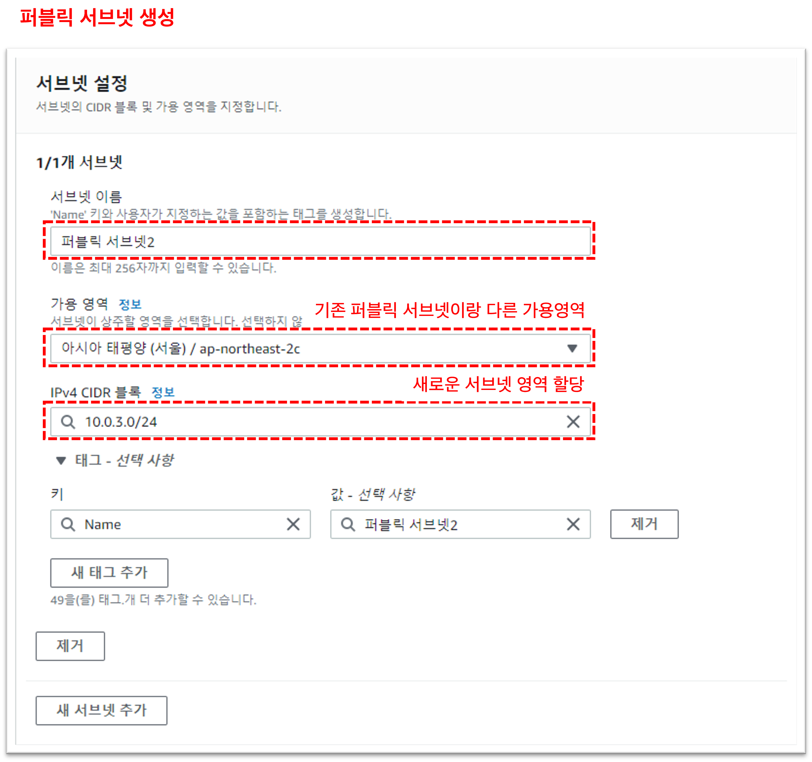  

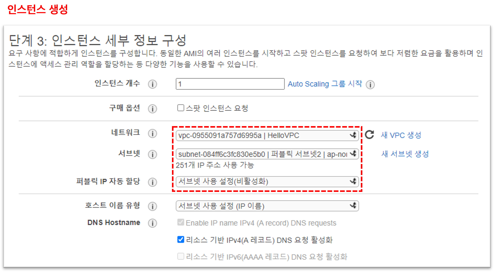  

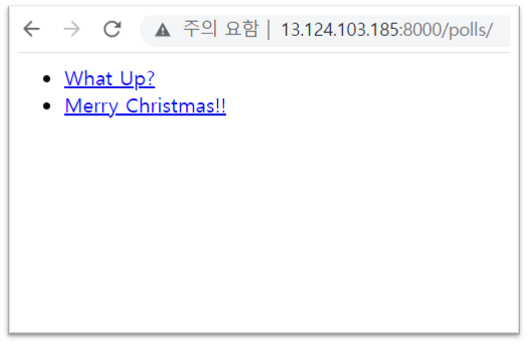  

똑같이 만들어주었다.  

### 2. 로드밸런서 타겟 그룹, 로드밸런서 생성하기

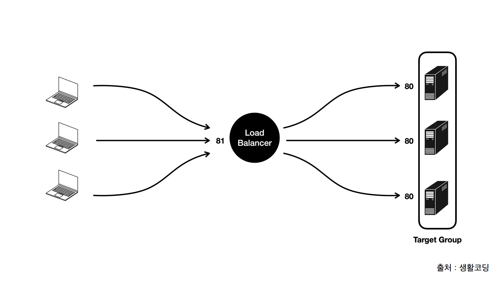  

요렇게 만들어줄거다. 로드밸런서는 클라이언트에게 81번 포트로 먼저 요청을 받아 적절하게 분산, 인스턴스로 이루어진 타겟 그룹에 80번 포트로 요청을 뿌려준다. (자세한 내용은 [생활코딩](https://youtu.be/s9FHdj6jd_U) 참고)  

먼저 타겟그룹부터 만든다. 

  

이후 인스턴스를 넣어서  타겟 그룹으로 묶어주자.  

그 다음 로드밸런서를 만들텐데, 로드밸런서 -> 로드밸런서 생성 -> 어플리케이션 로드 밸런서 생성 순으로 누른다.  

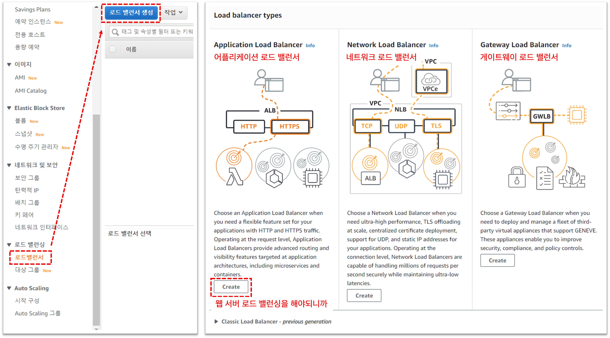  

이후로 Basic Configuration ->    Network mapping -> 보안그룹 생성 -> 리스너 and 라우팅 설정을 차례로 한다.  

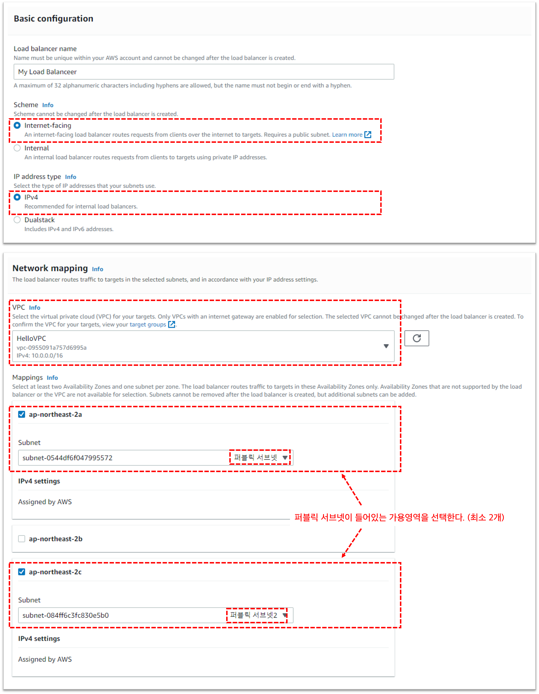    

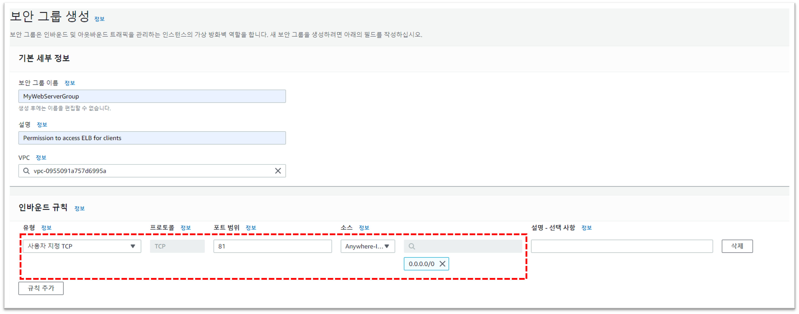   

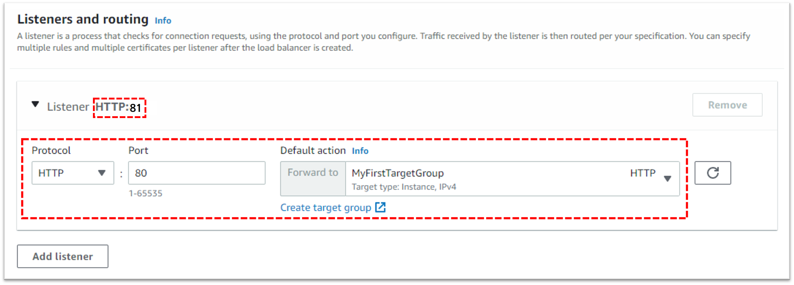  

인스턴스를 80번 포트로 열자. `sudo python3 manage.py runserver 0:80`  

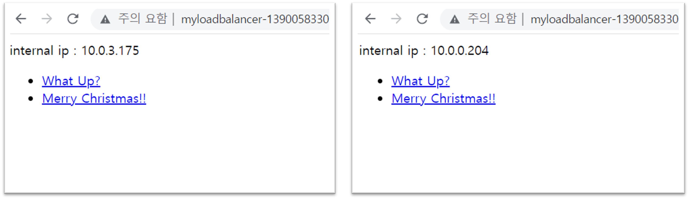  

(1. 보다 정확한 확인을 위해 index.html을 고쳐줬다.)   

(2. 서버에 접속이 안된다면 내부 private ip를 ALLOWED HOST에 추가해주도록하자.)  

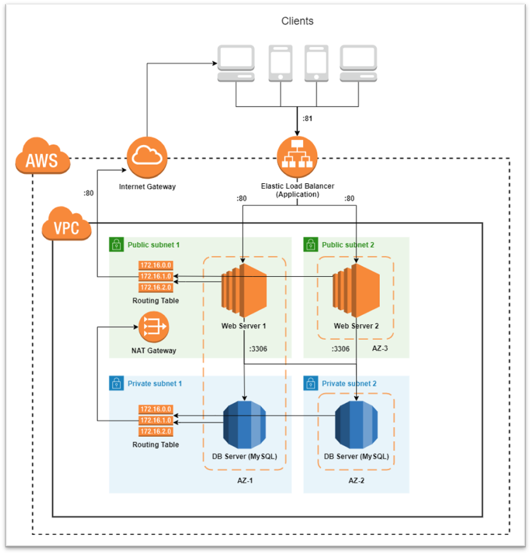  

현재까지 구성도를 정리한 그림이다.   

## 7. Auto Scale 써보기

[생활코딩강의](https://youtu.be/_1Yqk-fLkec)를 참고했다.

### 1. 이미지(AMI) 생성하기

Auto Scale은 트래픽이 많이 들어왔을 때, 웹 서버 인스턴스를 자동으로 생성해주거나 종료해주는 서비스를 말한다. 웹 서버 인스턴스를 자동으로 생성하기 위해서는 원래의 웹 서버와 완전하게 똑같은 파일과 구성을 가진 환경을 복사해야하는데, 이를 이미지화시켜서 저장해놓았다가 필요할 때 Auto Scale이 쓰도록 한다.  

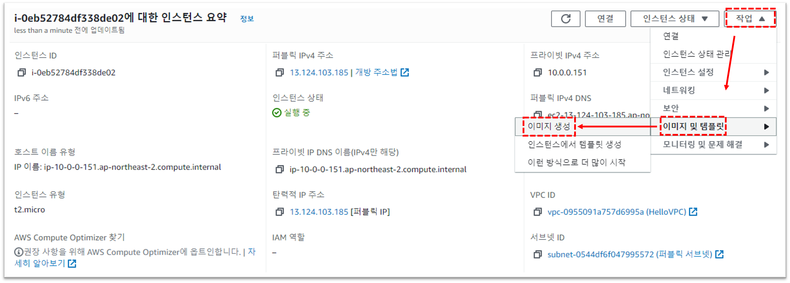  

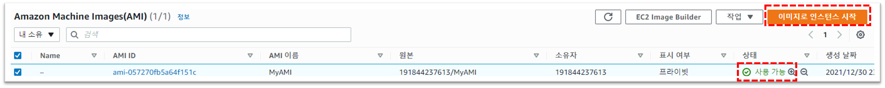 

AMI 탭에 들어가면 이미지가 잘 생성된 것을 확인할 수 있다.  

이제 생성한 AMI를 이용해서  인스턴스를 만들어보자.  

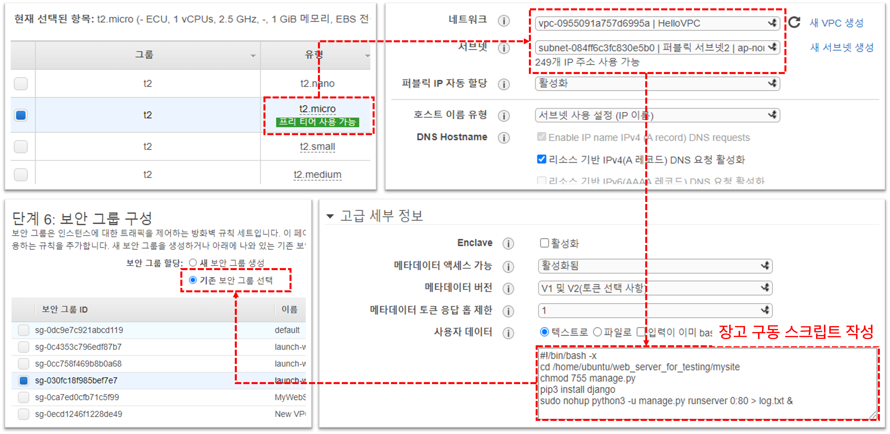  

주의할 점은, 이미지에서 인스턴스를 생성할 때는 그 환경만 생성하기 때문에 웹서버를 구동하는 과정을 선언해줘야 한다. 고급 세부 정보 칸에서 사용자 데이터(User-data)에 서버 구동을 위한 SSH 스크립트를 작성해준다([AWS 공식문서](https://docs.aws.amazon.com/ko_kr/AWSEC2/latest/UserGuide/user-data.html)).  

1. 스트립트가 작동이 안되는데 뭐가 문제인지 모르겠다면 인스턴스에 접속해서 `/var/log/cloud-init.log` or `/var/log/cloud-init-output.log`를 확인하자([Stackoverlow](https://stackoverflow.com/questions/15904095/how-to-check-whether-my-user-data-passing-to-ec2-instance-working-or-not))  
2. 퍼블릭 IP 자동 할당은 안해도 로드 밸런서에서 알아서 잘해준다(내가 해봤다).

### 2. Launch Template(시작 템플릿)

시작 템플릿이란 이미지, 인스턴스 유형, 네트워크 설정, 보안 그룹 등을 미리 템플릿으로써 설정해놓고 해당 구성을 쉽게 생성하기 위해 사용한다. 보통 Auto Scale에서 똑같은 구성의 인스턴스를 여러개 생성할 때 사용함. EC2 -> 인스턴스  -> 시작 템플릿 -> 시작 템플릿 생성  

그 다음에는 위에서 인스턴스 생성할 때 했던 것 처럼 설정을 골라주면 되는데, 마지막에 고급 세부정보를 눌러서 사용자 데이터를 입력해주는걸 잊지말자.  

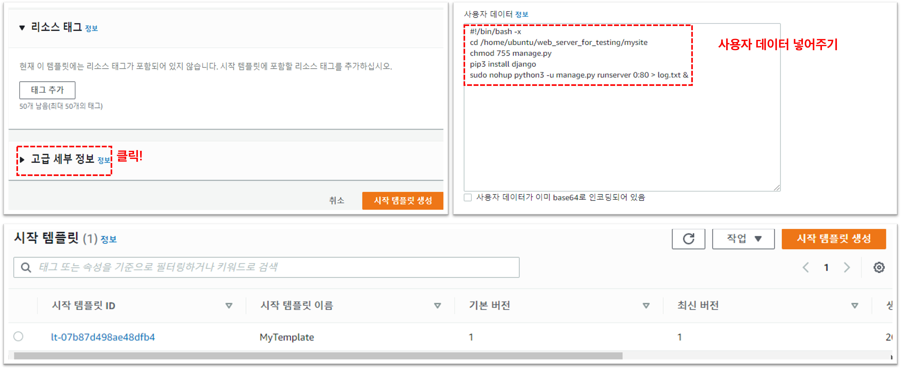  

### 3. Auto Scaling Group 생성

EC2탭 -> Auto Scaling -> Auto Scaling Group -> 생성누르고 시키는대로 눌러주면 된다. 로드밸런서는 기존의 것을 사용하자.  

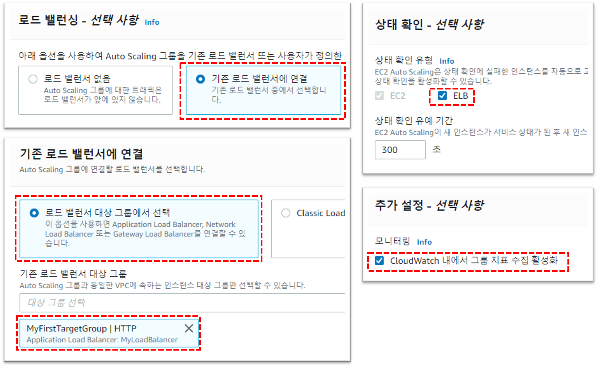  

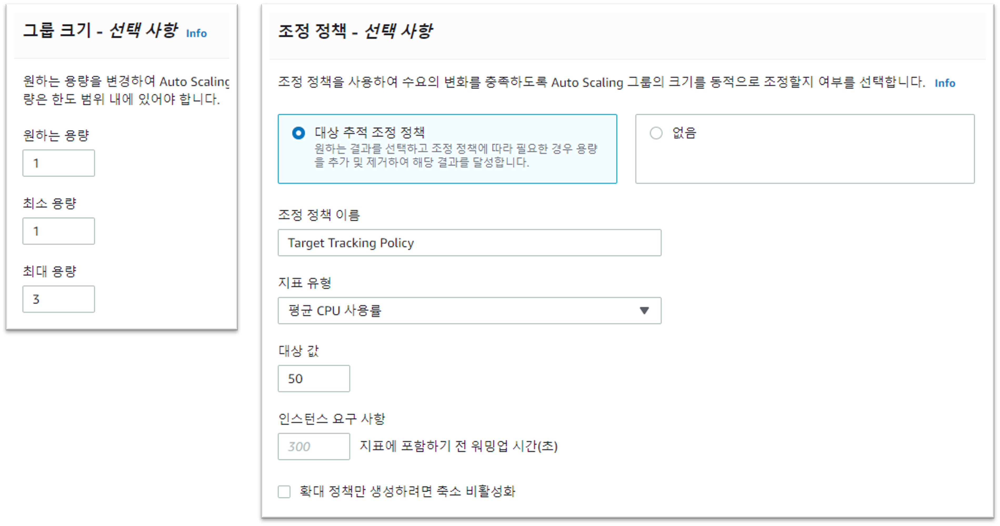  

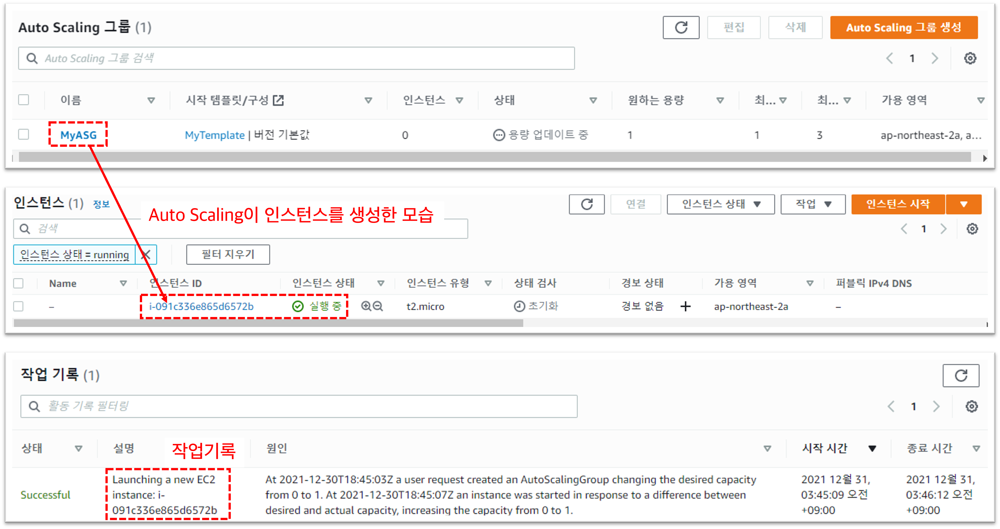  

생성완료  


---

### Reference

[정환타님 개발노트](https://junghwanta.tistory.com/category/Dev-AWS)  

[장고 공식문서](https://docs.djangoproject.com/ko/4.0/)  

[AWS 공식문서](https://docs.aws.amazon.com/ko_kr/AmazonRDS/latest/UserGuide/USER_ConnectToInstance.html)  

[공부혜옹님 블로그](https://hae-ong.tistory.com/25)  

[Che1님 블로그](https://nachwon.github.io/django-deploy-1-aws/)  

